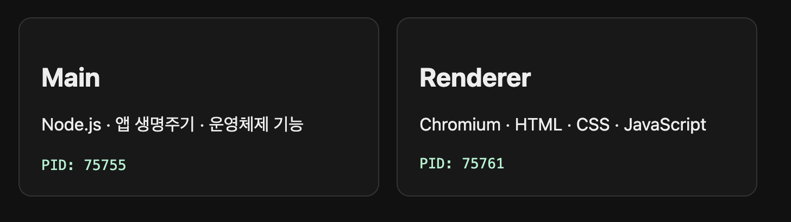

Electron은 HTML, CSS, JavaScript로 데스크톱 앱을 만드는 프레임워크다. 앱이 실행되면 Main Process가 Electron API로 창을 만들고 앱의 생명주기를 관리한다. 각 창의 Renderer Process에서는 Chromium이 HTML과 CSS로 작성한 화면을 표시하고 JavaScript를 실행한다.

> 즉, Main Process가 앱의 창을 만들고, Renderer Process가 그 창 안의 화면을 그린다.

이 글에서는 작은 Electron 앱을 실행해 두 프로세스의 PID를 확인하고, 분리된 프로세스가 Preload와 IPC로 통신하는 과정을 따라가 본다. 글에 사용한 코드는 [실습 저장소](https://github.com/brgndyy/electron-study)에서 업로드 해둔다.

## Chromium은 무엇일까?

Chromium은 웹페이지를 불러오고 실행하는 데 필요한 렌더링, JavaScript 실행, 네트워크, 저장소, 보안 기능 등을 포함한 오픈소스 브라우저 프로젝트다. Chrome과 Edge를 비롯한 여러 브라우저가 Chromium을 기반으로 만들어졌다.

Electron은 Chromium의 멀티프로세스 구조를 이어받았다. Chromium의 Browser Process와 Renderer Process에 대응하는 역할을 Electron에서는 Main Process와 Renderer Process가 나눠 맡는다.

내부적으로 동일하게 Chromium을 사용하기 때문에, Renderer Process에서는 일반 웹페이지와 비슷한 방식으로 HTML, CSS, JavaScript가 실행된다. HTML은 화면의 구조를 만들고, CSS는 레이아웃과 스타일을 담당한다. JavaScript는 버튼 클릭이나 화면 변경 같은 동작을 처리한다.

## 한 앱인데 왜 PID가 두 개일까?

실습 앱을 실행하면 화면에 다음처럼 서로 다른 PID가 표시된다. 숫자는 실행할 때마다 달라진다.




PID(Process ID)는 운영체제가 실행 중인 프로세스를 구별하려고 붙이는 임시 번호다. 프로그램을 종료하고 다시 실행하면 PID도 달라질 수 있다.

실습 화면에는 Main Process와 현재 창의 Renderer Process에 서로 다른 PID가 표시된다. 두 역할이 같은 프로세스 안의 함수로 실행되는 것이 아니라, 운영체제에서 분리된 프로세스로 실행된다는 뜻이다.

(지금 동작하는 프로세스들 뿐만 아니라 GPU나 Utility 같은 보조 프로세스가 추가로 실행될 수 있다.)

## Main Process는 무엇을 할까?

Main Process는 진입점 역할을 한다. Main Process는 Node.js 환경에서 실행되며 `BrowserWindow`로 앱 창을 만들고, `app` 모듈로 시작과 종료 같은 생명주기를 관리한다. 메뉴, 파일 선택창, 트레이 아이콘처럼 운영체제와 맞닿은 기능도 Electron API로 호출한다.

`createWindow()`는 창 생성과 Renderer 설정을 담당한다.

```js
// main.js
function createWindow() {
  // Main Process가 운영체제의 앱 창과 그 안의 웹 콘텐츠 영역을 만든다.
  const window = new BrowserWindow({
    width: 800,
    height: 560,
    webPreferences: {
      // 웹 콘텐츠보다 먼저 실행할 연결 스크립트를 지정한다.
      preload: path.join(__dirname, "preload.js"),
      // Preload와 웹페이지의 JavaScript 실행 공간을 분리한다.
      contextIsolation: true,
      // 웹페이지에서 require() 같은 Node.js 기능을 직접 사용하지 못하게 한다.
      nodeIntegration: false,
      // Renderer를 제한된 권한의 Chromium 샌드박스에서 실행한다.
      sandbox: true,
    },
  });

  // 예제 화면이 다른 주소로 이동하거나 새 창을 열지 못하게 한다.
  window.webContents.on("will-navigate", (event) => event.preventDefault());
  window.webContents.setWindowOpenHandler(() => ({ action: "deny" }));

  // Chromium Renderer가 표시할 로컬 HTML 파일을 불러온다.
  window.loadFile("index.html");
}
```

`new BrowserWindow()`는 운영체제에 앱 창을 만들고 그 안에 웹 콘텐츠를 담을 영역을 준비한다. `window.loadFile("index.html")`이 호출되면 해당 창의 Renderer Process가 로컬 HTML 파일을 불러온다.

```js
// main.js
app.whenReady().then(() => {
  createWindow();

  // macOS에서 Dock 아이콘을 다시 누를 때 열린 창이 없으면 새 창을 만든다.
  app.on("activate", () => {
    if (BrowserWindow.getAllWindows().length === 0) createWindow();
  });
});
```

`app.whenReady()`가 완료되면 `createWindow()`를 호출한다. macOS에서는 모든 창을 닫아도 앱이 종료되지 않을 수 있으므로, Dock 아이콘을 다시 눌렀을 때 창이 없다면 새 창을 만든다.

## Renderer Process는 무엇을 할까?

각 `BrowserWindow`의 웹 콘텐츠는 별도의 Renderer Process에서 실행된다. Renderer는 브라우저 탭처럼 HTML로 구조를 만들고 CSS로 표현하며 JavaScript로 사용자 입력과 화면 변경을 처리한다.

이 예제의 `renderer.js`는 두 프로세스의 PID를 받아 HTML에 표시한다.

```js
// renderer.js
async function showProcessInfo() {
  // Preload가 공개한 제한된 API로 두 프로세스의 PID를 가져온다.
  const processInfo = await window.electronStudy.getProcessInfo();

  // 받은 PID를 현재 HTML의 각 표시 영역에 넣는다.
  document.querySelector("#main-pid").textContent = processInfo.mainPid;
  document.querySelector("#renderer-pid").textContent = processInfo.rendererPid;

  // PID 표시까지 끝났음을 알린다.
  window.electronStudy.ready();
}

// 화면 로드 후 PID 조회를 시작하고, 실패하면 오류 메시지를 표시한다.
showProcessInfo().catch((error) => {
  document.querySelector("#status").textContent = error.message;
});
```

여기서 눈에 띄는 부분은 `window.electronStudy.getProcessInfo()`다. 이 함수는 웹 표준 API가 아니다. preload.js가 현재 Renderer에 필요한 기능만 골라서 공개한 것이다.

## 프로세스를 왜 나눌까?

Main과 Renderer는 맡은 역할뿐 아니라 권한도 다르다. Main Process는 Node.js와 Electron API를 사용해 파일 시스템이나 운영체제 기능에 접근할 수 있다. Renderer Process는 사용자가 보는 웹 콘텐츠를 처리한다.

화면에는 사용자 입력이나 외부에서 받은 데이터처럼 신뢰할 수 없는 값이 들어올 수 있다. Renderer에 Main과 같은 권한을 그대로 주면 화면에 삽입된 악성 코드도 파일 시스템과 운영체제 기능에 접근할 가능성이 생긴다. Electron은 Renderer에서 Node.js 직접 접근을 막고, 필요한 기능만 좁게 공개하는 구성을 권장한다.

프로세스 분리는 안정성에도 영향을 준다. 모든 일을 한 프로세스에서 처리하면 웹 콘텐츠 하나가 멈췄을 때 앱 전체가 영향을 받는다. Chromium과 Electron의 멀티프로세스 구조는 웹 콘텐츠를 별도 Renderer에서 실행해 이런 영향을 제한한다.

하지만 이렇게 분리된 각 프로세스는 독립된 메모리 공간에서 실행되므로 Renderer가 Main에 선언된 변수나 함수를 직접 읽고 호출할 수 없다.

## 그럼 분리된 프로세스는 어떻게 통신할까?

Electron은 IPC(Inter-Process Communication), 즉 프로세스 간 통신 기능을 제공한다. Main에서는 `ipcMain`, Renderer 쪽에서는 `ipcRenderer`가 메시지를 주고받는다.

하지만 현재 예제는 `nodeIntegration: false`로 설정돼 있다. 따라서 웹페이지에서 `require("electron")`을 호출해 `ipcRenderer`를 직접 가져올 수 없다. 대신 Renderer 안에서 웹 콘텐츠보다 먼저 실행되는 Preload Script가 필요한 기능만 공개한다.[1]

전체 흐름은 다음과 같다.

```text
Electron 실행
    ↓
Main Process에서 main.js 실행
    ↓
app.whenReady() → createWindow()
    ↓
BrowserWindow 생성 → loadFile("index.html")
    ↓
Renderer Process에서 preload.js 먼저 실행
    ↓
contextBridge가 window.electronStudy 공개
    ↓
index.html과 renderer.js 실행
    ↓
Renderer가 getProcessInfo() 호출
    ↓
ipcRenderer.invoke("process:get-main-pid")
    ↓
Main의 ipcMain.handle()이 요청 처리
    ↓
Main PID 반환
    ↓
Renderer가 Main·Renderer PID를 화면에 표시
```

이 흐름을 코드별로 나눠보자.

## Preload에 대하여

Preload는 별도의 프로세스가 아니다. Renderer Process 안에서 웹 콘텐츠보다 먼저 실행되는 연결 스크립트다. 현재 예제는 `contextIsolation: true`도 사용한다. 이 설정은 Preload와 웹페이지의 JavaScript 실행 공간을 분리하고, 웹페이지가 Preload의 강한 권한에 직접 접근하지 못하도록 막는다.

분리된 실행 공간 사이에 기능을 공개할 때 `contextBridge`를 사용한다.

```js
// preload.js
const { contextBridge, ipcRenderer } = require("electron");

contextBridge.exposeInMainWorld("electronStudy", {
  getProcessInfo: async () => ({
    // Main PID는 다른 프로세스의 값이므로 IPC로 요청한다.
    mainPid: await ipcRenderer.invoke("process:get-main-pid"),
    // Preload는 Renderer Process 안에서 실행되므로 현재 PID가 Renderer PID다.
    rendererPid: process.pid,
  }),
  // 화면 표시까지 끝났다고 Main에게 알린다.
  ready: () => ipcRenderer.send("study:ready"),
});
```

`contextBridge.exposeInMainWorld("electronStudy", ...)`는 웹페이지의 `window`에 `electronStudy`라는 API를 공개한다. Renderer는 Electron 전체 API를 받는 대신 `getProcessInfo()`와 `ready()`만 호출할 수 있다.

`getProcessInfo()`가 반환하는 PID의 출처도 다르다. Preload는 Renderer Process 안에서 실행되므로 `process.pid`로 현재 Renderer PID를 읽는다. Main PID는 다른 프로세스의 값이어서 `ipcRenderer.invoke()`로 요청한다.

## Main은 IPC 요청을 처리한다

Preload가 보낸 `process:get-main-pid` 요청은 Main Process의 `ipcMain.handle()`에 도착한다.

```js
// main.js
const indexUrl = pathToFileURL(path.join(__dirname, "index.html")).href;

// 다른 페이지나 iframe이 Main Process의 IPC 기능을 호출하지 못하게 막는다.
function isTrustedSender(event) {
  return event.senderFrame === event.sender.mainFrame && event.senderFrame.url === indexUrl;
}

// Renderer가 요청하면 Main Process의 실제 운영체제 PID를 돌려준다.
ipcMain.handle("process:get-main-pid", (event) => {
  if (!isTrustedSender(event)) throw new Error("Untrusted IPC sender");
  return process.pid;
});
```

`ipcRenderer.invoke()`와 `ipcMain.handle()`에 같은 채널 이름인 `process:get-main-pid`를 사용했다. Main은 요청을 보낸 대상이 이 앱의 최상위 `index.html` 문서인지 검사한 뒤 자신의 PID를 리턴한다.

응답은 다시 Preload의 `getProcessInfo()`를 거쳐 Renderer로 돌아온다. `renderer.js`는 받은 값을 HTML에 넣는다. 처음 화면에서 본 두 PID는 위의 작업들을 통해 나타난다.